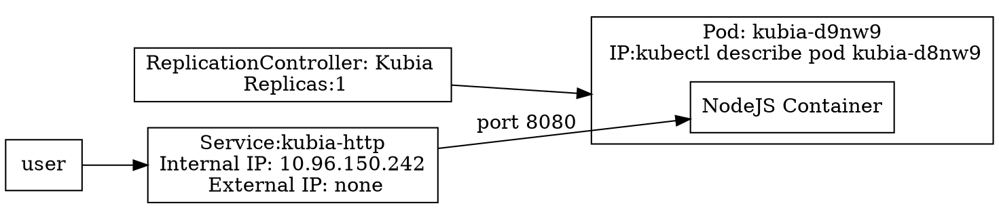
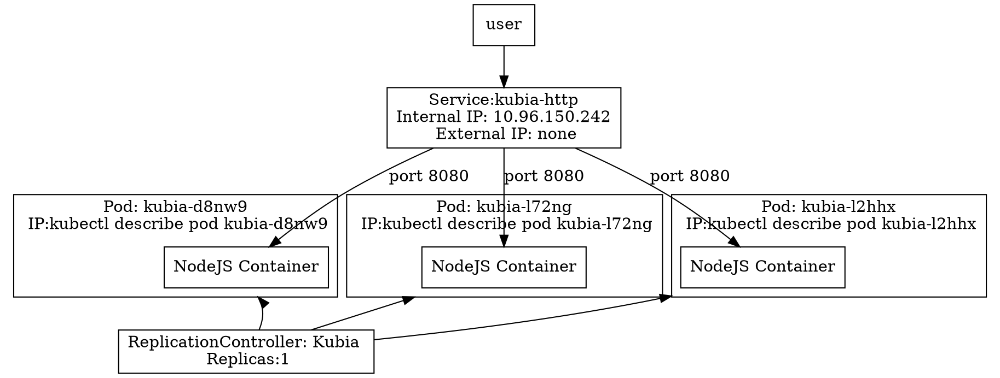

# First steps with Docker and Kubernetes

- This chapter covers:
  - Creating, running and sharing a container image with Docker
  - Running a single-node Kubernetes cluster locally
  - Setting up a Kubernetes cluster on Google Kubernetes Engine
  - Setting up and using the `kubectl` command-line client
  - Deploying an app on Kubernetes and scaling it horisontally

## 2.1 Creating, Running and Sharing a Container Image

- The next few sections cover:
  1. Installing docker
  2. Creating a trivial Node.js app that you'll later deploy to Kubernetes
  3. Package the app into a container image so you can then run it as an isolated container.
  4. Run a container based on the image
  5. Push the image to Docker Hub so that anyone anywher can run it.

### 2.1.1 Installing Docker and Running a Hello World Container

- Digital ocean has a good docker install tutorial

#### Running a Hello World Container

- Docker's hello world is run with:

```sh
$ docker run busybox echo "Hello world"
```

- This runs a busybox container (a container with busy box as its base OS) and tells it to print out `Hello world`.
- The important thing about hello world here is that it could have been a complex application, not just hello world.

#### Understanding What Happends behind the Scenes

- Docker pulled busybox from docker.io and ran `echo "hello world"` on it.

#### Running other Images

- Generally, docker images are run like `docker run <image>`, without specifying a command after the image name.

#### Versioning Container Images

- To run a specific version of an image use `docker run <image>:<tag>`

### 2.1.2 Creating a Trivial Node.js App

- To test kubernetes, we're building [app.js](./node_app/app.js), a simple web app that accepts HTTP requests, logs the incoming IP address and responds with its hostname.
  - This demonstrates how kubernetes handles hostnames. Note, this name is different from the http HOST header sent by the client.
  - This is exercise is useful for scaling out. You'll see requests hitting different replicas.

### 2.1.3 Creating a Dockerfile for the Image

- To test kubernetes, we're building a [Dockerfile](./node_app/Dockerfile) that runs app.js

### 2.1.4 Building the Container Image

- Before we run the app as a container, we must build an image (named `kubia`) from the Dockerfile.

```sh
$ cd ./node_app
$ docker build -t kubia .
```

#### Understanding How an Image is Built

- The docker client tells the docker daemon builds the image. The docker daemon then pulls all the related files and builds the image. Note, these components don't have to be on the same computer. This is how tools like `docker-machine` work.

#### Understanding Image Layers

- Each docker image layer corresponds to a docker file command. Docker downloads each of these layers individually (unless the layer is stored locally).
- The last layer of an image is tagged. For example, in our example Dockerfile, the last layer is tagged as `kubia:latest`
- You can ess all images using `docker images` or `docker image ls`

#### Comparing Building IMages with a Dockerfile vs Manually

- An alternative to creating a docker file is to create a docker container, run commands in it, then build an image from the container's final state. This is bad practice. Using a Dockfile is essentially the same thing, but it's automatic, repeatable and you can source control it.

### 2.1.5 Running the Container Image

- run the container with `docker run --name kubia-container -p 8008:8008 -d kubia`
  - `-d` detaches the container's stdout from the shell it's running in.
  - `-p 8080:8080` maps the host's port 8080 to the container's
  - `--name kubia-container` names the container kubia-container

- You can access the container on the IP of the docker daemon's host.
  - On linux, this is generally localhost.
  - On windows, the daemon runs in a VM, so look up the VM's IP through the DOCKER_HOST environment variable.

#### Accessing Your App

- For me, `curl localhost:8080` produces `You've hit d03bbde8ff04`
- `d03bbde8ff04` is the hex ID of the container.

#### Listing All Running Containers

- To see what containers are running use `docker ps` or `docker container ls`. It produces the following:

```sh
docker container ls
CONTAINER ID        IMAGE                 COMMAND             CREATED             STATUS              PORTS                                            NAMES
d03bbde8ff04        kubia                 "node app.js"       8 minutes ago       Up 8 minutes        0.0.0.0:8080->8080/tcp                           kubia-container
849f1a10f18c        portainer/portainer   "/portainer"        18 hours ago        Up 18 hours         0.0.0.0:8000->8000/tcp, 0.0.0.0:9000->9000/tcp   vibrant_golick
```

##### Getting Additional Information about a Container

- For more information about the kubia-container use `docker inspect kubia-container`. This will give a JSON description of the container.

### 2.1.6 Exploring the Inside of a Running Container

- You can run any of the executables as a process inside a container, even the shell.

#### Running a Shell inside an Existing Container

- `docker exec -it kubia-container bash` this runs a shell in kubia-container
  - This shell has the same Linux namespaces as the main container process.
  - The `-it` option means:
      - `-i` keeps STDIN open for receiving user input
      - `-t` allocates a pseudo terminal (TTY) to the container
    
#### Exploring the Container from within

- When you run `ps aux` you see:

```sh
ps aux
USER       PID %CPU %MEM    VSZ   RSS TTY      STAT START   TIME COMMAND
root         1  0.0  0.1 614436 26568 ?        Ssl  12:22   0:00 node app.js
root        11  0.0  0.0  20248  3252 pts/0    Ss   12:47   0:00 bash
root        17  0.0  0.0  17504  1980 pts/0    R+   12:50   0:00 ps aux
```

- Importantly, you don't see any of the host's processes.

#### Understanding That Processes in a Container Run in the Host OS

- When you run `ps aux | grep app.js`, you'll see `app.js` among your running processes:

```sh
USER       PID %CPU %MEM    VSZ   RSS TTY      STAT START   TIME COMMAND
root      4295  0.0  0.1 614436 26568 ?        Ssl  12:22   0:00 node app.js
```

- Notice that app.js on the host has a different PID than inside the container. This is because the host and the container have different process trees.

#### The Container's Filesystem is Also Isolated

- Use `ls` inside the container. see that its files are isolated.
- Exit the container with `exit`
- The container also has its own: users, hostname, and network interfaces.

### 2.1.7 Stopping and Removing a Container

- `docker stop kubia-container` stops the container
- Note, the container still exists, it's just not running. See it with `docker ps -a`
- To fully remove the container use `docker rm kubia-container`

### 2.1.8 Pushing the Image to an Image Registry

- Pushing to the registry can be done in your gitlab-ci script https://docs.gitlab.com/ee/ci/docker/using_docker_build.html
- We're pushing our image to Docker Hub.
- To push to docker hub you need to tag the image with your ID. Mine is `michaellundquist`

#### Tagging an Image under an Additional Tag

- First, let's look at the existing images:

```sh
$ docker image ls
REPOSITORY            TAG                 IMAGE ID            CREATED             SIZE
kubia                 latest              de85b699559a        20 hours ago        660MB
portainer/portainer   latest              ff4ee4caaa23        7 weeks ago         81.6MB
hello-world           latest              fce289e99eb9        13 months ago       1.84kB
node                  7                   d9aed20b68a4        2 years ago         660MB
```

- Next, add a tag to the image with `docker tag kubia michaellundquist/kubia`
- Then view the existing images again:

```sh
docker image ls
REPOSITORY               TAG                 IMAGE ID            CREATED             SIZE
kubia                    latest              de85b699559a        20 hours ago        660MB
michaellundquist/kubia   latest              de85b699559a        20 hours ago        660MB
portainer/portainer      latest              ff4ee4caaa23        7 weeks ago         81.6MB
hello-world              latest              fce289e99eb9        13 months ago       1.84kB
node                     7                   d9aed20b68a4        2 years ago         660MB
```

- Note, the image `de85b699559a` has multiple tags

#### Pushing the Image to Docker Hub

- `docker login` logs you in
- `docker push michaellundquist/kubia` pushes the image to the registry.

### Running the Image on a Different Machine

- You can now run the image on any machine with `docker run -p 8080:8080 --name kubia -d michaellundquist/kubia`

## 2.2 Setting up a Kubernetes Cluster

- There are multiple ways to install kubernetes:
  - On your dev machine
  - on your organization's cluster
  - on a cloud provider's
  - using a managed kubernetes cluster such as Google Kubernetes Engine (previously Google Container Engine)

- This chapter covers:
  - installing a single-node cluster on your local machine
  - running a hosted cluster on Google Kubernetes Engine (GKE)

- Appendix B covers installing a 3 node cluster using VMs with the `kubeadm` tool. It's too advanced for right now, but is useful for aws.

### 2.2.1 Running a Local Single-Node Kubernetes Cluster with Minikube

- They recommend minikube. I'm using microk8s

#### Installing Minikube

- google it
- Remember to set the permissions correctly on things. (775?)

#### Starting a Kubernetes Cluster with Minikube

- `minikube start`
- With microk8s it's `microk8s.start`

#### Installing the kubernetes client (kubectl)

- Ch 11 shows how to use kubectl to control multiple clusters
- Microk8s comes with kubectl `microk8s.kubectl`. I aliased this as `alias kubectl=microk8s.kubectl` so I don't have to type microk8s every time

#### Checking to See the Cluster is up and kubectl can talk to it

- `kubectl cluster-info` verifies the cluster is working. It displays the locations of various kubernetes components including the API server and the web console:

```sh
kubectl cluster-info
Kubernetes master is running at https://127.0.0.1:16443
Heapster is running at https://127.0.0.1:16443/api/v1/namespaces/kube-system/services/heapster/proxy
CoreDNS is running at https://127.0.0.1:16443/api/v1/namespaces/kube-system/services/kube-dns:dns/proxy
Grafana is running at https://127.0.0.1:16443/api/v1/namespaces/kube-system/services/monitoring-grafana/proxy
InfluxDB is running at https://127.0.0.1:16443/api/v1/namespaces/kube-system/services/monitoring-influxdb:http/proxy

To further debug and diagnose cluster problems, use 'kubectl cluster-info dump'.
```

### 2.2.2 Using a Hosted Kubernetes Cluster with Google Kbuernetes Engine

- GKE is good because you know it's configured correctly. It can get pricy though.

#### Setting up a Google Cloud Project and Downloading the Necessary Client Binaries

- go to https://cloud.google.com/container-engine/docs/before-you-begin it will walk you through:
  1. signing up for a google account
  2. Creating a project in the GCP console
  3. Enabling billing
  4. Enabling the Kubernetes Engine API
  5. Downloading and installing the Google Cloud SDK (including the *gcloud* command-line tool, which you'll need to create a kubernetes cluster.)
  6. Installing the `kubectl` command-line tool with `gcloud components install`

#### Creating a Kubernetes Cluster with Three Nodes

- `gcloud container clusters create kubia --num-nodes 3 --machine-type f1-micro` creates a 3 node cluster in GCP

#### Getting an Overview of Your Cluster

- Kubectl talks to the kubernetes API server master node, that talks to the kubelet inside containers.

#### Checking if the Cluster is up by Listing Cluster Nodes

- `kubectl get nodes` shows the nodes in your cluster. For example:

```sh
kubectl get nodes
NAME       STATUS   ROLES    AGE   VERSION
minikube   Ready    master   56m   v1.17.0
```

- `kubectl get` can show a lot more than just nodes.
- On gcloud, you can ssh into a node with `gcloud compute ssh <node-name>`

#### Retrieving Additional Details of an Object

- `kubectl describe`... gives more information than `kubectl get`.

- For example, to get detailed information about the minikube node: `kubectl describe node minikube`
  - This gives the node's status, its CPU and memory data, system information, containers running on the node, etc.
  - `kubectl describe node` prints this detailed information for all nodes.

### 2.2.3 Setting up an Alias and Command-Line Completion for kubectl

- You can set up an alias to kubectl.
- I'm already aliasing `alias kubectl='minikube kubectl'` but generally aliasing is done in `~/.bashrc` or `~/.bash_aliases`

#### Configuring Tab Completion for kubectl

- Running `source <(kubectl completion bash)` configures tab completion for kubectl.
- I added this command to my `~/.bashrc` file so it gets run everytime I start a shell.

## 2.3 Running your First App on Kubernetes

- Generally, kubernetes apps are run from a JSON or YAML manifest that describes your app's components, but we haven't learned about those components yet so here we're just doing simple examples.

### 2.3.1 Deploying Your Node.js App

- `kubectl` can run the image we created earlier like:

```sh
$ kubectl run kubia --image=michaellundquist/kubia --port=8080 --generator=run/v1

kubectl run --generator=run/v1 is DEPRECATED and will be removed in a future version. Use kubectl run --generator=run-pod/v1 or kubectl create instead.
replicationcontroller/kubia created
```

- The flags in this command are:
  - `--image=michaellundquist/kubia` which tells the command what image to run
  - `--port=8080` which tells Kubernetes that your app is listening on port 8080.
  - `--generator` which tells kubernetes to use a *ReplicationController* instead of a *Deployment*. More on that later in this chapter and in chapter 9.

#### Introducing Pods

- __Pod__: a group of one or more tightly related containers that will always run together on the same worker node and in the same Linux namespace(s).
  - Each pod is like a separate logical machine with its own IP, hostname, processes... running a single application
    - The application can be a single process, running in a single container, or it can be a main application process and additional supporting processes, each running in its own container.

#### Listing Pods

- Pods are the fundamental element in kubernetes. If you want to see what's actually running you list pods.
  - Pods are to kubernetes as containers are to docker.

- `kubectl get pods` lists pods.

```sh
kubectl get pods
NAME          READY   STATUS    RESTARTS   AGE
kubia-d8nw9   1/1     Running   0          36m
```

- In the pod above, the 1/1 means the pod is ready. You can also tell that it's ready because it's in the running state.

- `kubectl describe pod kubia-d8nw9` will show you more information about the pod.
  - From here, you can see the pod's internal IP address, and see `You've hit kubia-d8nw9` when you go to that IP address. Note, this is the IP of only one pod running on one node. This isn't best practice. Pod IP addresses are ephemeral.
      - See the section about [accessing your web application](#2.3.2-Accessing-Your-Web-Application) 
  

- If a pod is stuck `pending`, kubernetes might be having trouble downloading the image. Maybe you marked it private in the registry. Try manually pulling the image with `docker pull`

#### Understanding What Happened behind the Scenes

- Pushing images is necessary because images on your local machine aren't available to other nodes.

- Steps:
  - The `kubectl run` command created a *ReplicationController* in the cluster by sending a REST HTTP request to the Kubernetes API server.
  - The *ReplicationController* created a pod that was then scheduled to one of the workers. 
  - The Kubelet on that worker saw that the pod was scheduled to it and instructed Docker to pull the specified image from the registry and run the container.

- __Scheduling__: assigning a pod to a node. The pod is run immediately.

### 2.3.2 Accessing Your Web Application

- For a comprehensive coverage of networking in kubernetes see [the GKE docs](https://cloud.google.com/kubernetes-engine/docs/concepts/network-overview#inside-cluster)
- Pods have ephemeral IP addresses that only point to a single pod and are only accessible from inside the cluster. __Service__ objects are used to overcome these limitations.
- In this section, we create a `LoadBalancer`-type service, then you can connect to the load balancer's public IP.

#### Creating a Service Object

- To create the service, expose the `ReplicationController` created when we ran [kubectl run...](#2.3.1-Deploying-Your-Node.js-App)

`kubectl expose rc kubia -- type=LoadBalancer --name kubia-http`

- Note, they used `rc` instead of `replicationcontroller`, they're the same thing.
  - [see here](https://kubernetes.io/docs/reference/kubectl/overview/#resource-types) for other abbreviations.

- It takes some time for the service to start so be patient.

#### Listing Services

- To see that the `kubia-http` service is running, use `kubectl get services`

```sh
kubectl get services
NAME         TYPE        CLUSTER-IP      EXTERNAL-IP   PORT(S)    AGE
kubernetes   ClusterIP   10.96.0.1       <none>        443/TCP    21h
kubia-http   ClusterIP   10.96.150.242   <none>        8080/TCP   14h
```

- The external IP address of `kubia-http` is `<none>` because I'm using minikube which doesn't support the `LoadBalancer` services. However on GKE they are supported and the external IP can be accessed from anywhere in the world!
- The cluster IP of `kubia-http` is `10.96.150.242`, which can be accessed from any machine in the cluster.

#### Accessing Your Service Through its External IP

- When you run `curl 10.96.150.242` you get `You've hit kubia-d8nw9`. If I had an external IP I could do this from anywhere in the world!
  - `kubia-d8nw9` is the hostname of a single pod with it's own IP on a single node. If we had more replicas running, it might change when we refresh.

### 2.3.3 The Logical Parts of Your System

- Kubernetes abstracts away physical hardware. We don't care what physical node we're running on. We only care about the `Pods`, `ReplicationControllers`, and `Services` running in our `Cluster`

#### Understanding How The `ReplicationController`, the `Pod`, and the `Service` Fit together

- `kubectl run` created a `ReplicationController` that created a `Pod`.
- To make pods accessible from outside the cluster, we simply exposed the `Pods` managed by the `ReplicationController` as a single `Service`



#### Understanding the `Pod` and its Container

- In the above diagram, the pod is running a single container running the kubia image and listening on port 8080.
- This pod could be running more containers, but it's not.
- As you can see each pod has its own IP that the service uses to communicate with it.

#### Understanding the Role of the `ReplicationController`

- The `ReplicationController` keeps the number of stated replicas running.
- In our example, we didn't specify a number of replicas so it defaulted to 1.
- If `kubia-d8nw9` ever died, the ReplicationController would start a new pod running the kubia container.

#### Understanding why you need a Service

- Pods are ephemeral. Services are not. You can reliably point at a service that then points to pods running the containers you want to connect to.

### 2.3.4 Horizontally Scaling the Application

- To see information about the running replication controller use `kubctl get rc`

```sh
kubectl get rc
NAME    DESIRED   CURRENT   READY   AGE
kubia   1         1         1       20h
```

- This output's __DESIRED__ section shows the number of replicas the replication controller is told to run
- The output's __CURRENT__ section shows the number of pods currently running.

#### increasing the Desired Relplica count

- To scale up the desired replica count use `kubectl scale rc kubia --replicas=3`
- Telling kubernetes the desired state, and letting it achieve the state automatically is an important principle of kubernetes.

#### Seeing the Results of the Scaling out

- You can see the scaling worked with `kubctl get rc`

```sh
kubectl get rc kubia
NAME    DESIRED   CURRENT   READY   AGE
kubia   3         3         3       20h
```

- You can also see the pods it created

```sh
kubectl get pods
NAME          READY   STATUS    RESTARTS   AGE
kubia-d8nw9   1/1     Running   0          20h
kubia-l2hhx   1/1     Running   0          3m22s
```

- It's important to build your app in a way that it can handle this kind of scaling.

#### Seeing Requests Hit all 3 Pods when Hitting the Service

- Now we have 3 pods and a service load balancing across them

```sh
for i in {0..5}; do curl 10.96.150.242:8080; done
You've hit kubia-l2hhx
You've hit kubia-d8nw9
You've hit kubia-l72ng
You've hit kubia-l2hhx
You've hit kubia-l72ng
You've hit kubia-d8nw9
```

#### Visualizing the New State of your System

- We now have 3 pods, so our visual looks different:



- Now to scale the replication controller back down

```sh
$kubectl scale rc kubia --replicas=1
replicationcontroller/kubia scaled

$ kubectl get rc
NAME    DESIRED   CURRENT   READY   AGE
kubia   1         1         1       21h
```

### 2.3.5 Examining What Nodes Your App is Running on

- It's not important what node your app is running on. Let kubernetes do its job.

#### Displaying the Pod IP and the Pod's Node When Listing Pods

- If you really want to know where a pod is running use this:

```sh
$ kubectl get pods -o wide
NAME          READY   STATUS    RESTARTS   AGE   IP           NODE       NOMINATED NODE   READINESS GATES
kubia-d8nw9   1/1     Running   0          21h   172.17.0.4   minikube   <none>           <none>
```

#### Inspecting other Details of a Pod with kubectl Describe

- You can also see what node the pod is running on with `kubectl describe pod <podname>` along with other information.

### 2.3.6 introducing the Kubernetes Dashboard

- kubernetes has the webUI, it's GUI

#### Accessing the Dashboard when Running Kubernetes in GKE

- `kubectl cluster-info | grep dashboard` gives the IP.
- `gcloud container clusters describe kubia | grep -E "username|password):"` gives the credentials.

#### Accessing the Dashboard When Using Minikube

- `sudo minikube dashboard` starts teh minikube dashboard. It doesn't require credentials.

## 2.4 Summary

- We covered some simple kubernetes commands:
  - Pull and run a public container
  - Package your apps into containers and push them to a registry
  - Enter and inspect a running container
  - Set up a multi-node Kubernetes cluster on GKE
  - Configure an alias and tab completeion for `kubectl`
  - list and inspect nodes, pods, services and replicationControllers
  - Run a container in kubernetes and expose it.
  - Basic understanding of pods, replication controllers, and services
  - Scaling
  - WebUI