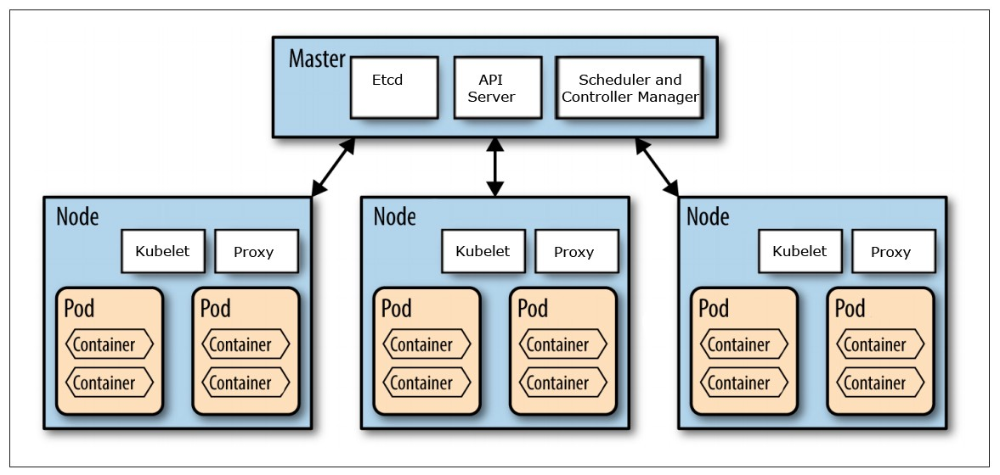

# Overview

- This chapter covers:
  - Keeping pods healthy
  - Running multiple instances of the same pod
  - Automatically rescheduling pods after a node fails
  - Scaling pods horizontally
  - Running system-level pods on each cluster node
  - Running batch jobs
  - Scheduling jobs to run periodically or once in the future

- IRL ReplicationControllers and Deployments should handle all pod creation and maintenance.
  - When you manually create pods, it runs on a single node. Kubernetes will restart the pod if it fails, but not if the node fails.

- This chapter covers using Replication controllers and Deployments to create managed pods that:
  - run indefinitely
  - perform a single task then stop

## 4.1 Keeping Pods Healthy



- When pods are scheduled manually, the kubelet is responsible for managing it. Kubelets run on nodes, the pod's lifecycle is attached to the node by default.
- By default, kubelets will restart your pods if they crash, but not if they're having errors (like `OutOfMemoryError` in java or stuck in an infinite loop...). Fortunately, kubernetes provides a way to restart in these cases.

### 4.1.1 Introducing Liveness Probes

- Kubernetes can run __Liveness probes__ periodically to check an application's health. If the probe fails, Kubernetes will restart the pod's containers.
- Liveness probes are specified at the pod level.
- Kubernets also supports *readiness* probes which are different.

- Kubernetes has 3 types of readiness probes:
  1. __HTTP GET__: this performs an HTTP GET request on the container's IP address, a port and a path you specify. If the GET response isn't an error (2xx or 3xx) the probe is considered successful. If the server returns an error or doesn't get a response, the container is restarted.
  2. __TCP Socket__: the probe tries to open a TCP connection to the specified port. If the connection is established successfully, the probe is successful. Otherwise the container is restarted.
  3. __Exec__: The probe executes a command in the container. If the command's status code is 0, the probe is successful. Otherwise, it fails.

### 4.1.2 Creating an HTTP-Based Liveness Probe

- To test an HTTP GET liveness probe, we will run a Node.js server (image luksa/kubia-unhealthy on hub.docker.io) that returns an error every 5th request.
- We defined our pod's yaml in [kubia-liveness-probe.yaml](./exercises/kubia-liveness-probe.yaml)

### 4.1.3 Seeing a Liveness Probe in Action

- After a few minutes, when you get the `kubia-liveness` pod, you'll see that its container been restarted:

```sh
$ kubectl get pods
NAME             READY   STATUS    RESTARTS   AGE
kubia-liveness   1/1     Running   3          7m54s
```

#### Obtaining the Application log of a Crashed Container

- `kubectl logs kubia-liveness` will only get the logs from the current container.
- To include logs from past containers use the `--previous` flag

```sh
$ kubectl logs kubia-liveness --previous
Kubia server starting...
Received request from ::ffff:172.17.0.1
Received request from ::ffff:172.17.0.1
Received request from ::ffff:172.17.0.1
Received request from ::ffff:172.17.0.1
Received request from ::ffff:172.17.0.1
Received request from ::ffff:172.17.0.1
Received request from ::ffff:172.17.0.1
Received request from ::ffff:172.17.0.1
```

- `kubectl describe pod kubia-liveness` will give you some information about why the container was failing.
  - `Exit Code` is 127 + `x` where `x` is the signal number sent to the process that caused it to terminate. In out example, `x` is 9 for __SIGKILL__
  - The events at the bottom show why the container was killed. In our case, it was unhealthy.

- Note, when a container is killed, it's a new container, not a restart of the old container.

### 4.1.4 Configuring Additional Properties of the Liveness Probe

- Liveness probes can have a few properties docs for them can be found with `kubectl explain pod.spec.containers.livenessProbe`. 

- Some notable liveness probe properties are:
  - `initialDelaySeconds <integer>`: Number of seconds after the container has started before liveness probes are initiated. [More info](https://kubernetes.io/docs/concepts/workloads/pods/pod-lifecycle#container-probes)
  - `periodSeconds	<integer>`: How often (in seconds) to perform the probe. Default to 10 seconds. Minimum value is 1.
  - `timeoutSeconds	<integer>`: Number of seconds after which the probe times out. Defaults to 1 second. Minimum value is 1. [More info](https://kubernetes.io/docs/concepts/workloads/pods/pod-lifecycle#container-probes)

- Setting the initial delay is __really important__. it allows your containers to start before the probing them for restarts.

### 4.1.5 Creating Effective Liveness Probes

- Always create liveness probes in production so your app kubernetes can tell if your app is working.

#### What a Liveness Probe Should Check

- Simple liveness probes like the one in our demonstration can effectively detect errors in many situations.

- A more advanced liveness probe might include a call to a `/health` URL that checks if the container's components are healthy.
  - Make sure this end-point doesn't require authentication

- Liveness probe responses should not be affected by factors external to the health of a website.
  - For example, if your database is failing, your front-end will fail but it's liveness-probe end-point shouldn't

#### Keeping Probes Light

- Liveness probes shouldn't drain your container's computational resources.
  - Later we'll learn how to limit the resources consumed by a container, making this even more important.
  - By default, liveness probes are allowed 1 second to reply. This is a good benchmark to tell if a liveness probe is light enough.

- __Tip__: don't use exec probes with java. They will start a new JVM for each probe which uses a lot of resources

#### Don't Bother Implementing Retry Loops in Your Probes

- Kubernetes uses the `failureThreshold` parameter to retry failed probes. Don't try to implement your own.

#### Liveness probe Wrap-up

- Liveness probes run on the kubelet. If your node dies, your liveness probe won't help you.

## 4.2 Introducing `ReplicaitonControllers`

- ReplicationControllers monitor pods and replace them if they fail.
- Unlike kubelets, ReplicatonControllers can detect and recover from node failures.
- Replication controllers are designed to keep `n` instances of a pod running across your various nodes.

### 4.2.1 The Operation of a Replication Controller

- Replication controllers use label selectors to ensure that the number of pods with a certain label matches the desired number of pods with that label.
  - If there are too many pods with that label, the replication controller will delete pods
  - If there are too few pods with that label, the replication controller will create pods

#### Introducing the Controller's Reconciliation Loop

- The ReplicationController uses the __reconciliation loop__ to bring the number of pods to the desired state

#### Understanding the Three Parts of a Replication Controller

- ReplicationControllers have 3 essential parts:
  1. A __label selector__ that determines which pods are in the ReplicationController's scope
  2. A __replica count__, which specifies the desired number of pods that should be running
  3. A __pod template__ which is used when creating a new pod replica

- All of these essential parts can be changed at any time, but only changes to the replica count will affect existing pods.

#### Understanding the Effect of Changing the Controller's Label Selector or Pod Template

- The label selector doesn't affect running pods because they're out of the repliation controller's scope. If you change the label selector, the replication controller will simply think it has no replicas running and will create new ones.
- Changing the pod template doesn't affect running pods because they've already been created. When new pods are created, they will be created with the new pod template, but that doesn't affect running pods.

#### Understanding the Benefit of Using a ReplicationController

- Although replication controllers are simple they enable:
  - ensuring a pods are always running
  - ensuring pods keep running across node failures
  - manual and automatic horizontal scaling (more on this in ch 15)

- Note: replicas have no relation to each other. If a pod on a node fails, the replication controller will create an entirely new pod not relocate the failed pod.

### 4.2.2 Creating a ReplicationController

- In this example,  we're creating a replicaton controller for kubia from [kubia-rc.yaml](./exercises/kubia-rc.yaml).

- Notice the `spec.selector` and the `spec.template.metadata.labels` parameters *match*. These parameters are how the __label selector__ works.
  - If these don't match, you would create infinite pods (the API server verifies that these match).
  - You don't actually have to specify `spec.selector`. Kubernetes will do this automatically if you don't.

- Notice the `spec.template`. This is the __pod template__ works
  - Notice how similar templates are to manual pod definitions.

- Notice the `spec.replicas`. This is the __replica count__
- To create the pod:

```sh
$ kubectl create -f ./exercises/kubia-rc.yaml 
replicationcontroller/kubia created
```

### 4.2.3 Seeing the Replication Controller in Action

- The replication controller created 3 new pods for you:

```sh
$ kubectl get pods -l app=kubia -L app
NAME          READY   STATUS    RESTARTS   AGE   APP
kubia-4kbsc   1/1     Running   0          69s   kubia
kubia-vglwh   1/1     Running   0          69s   kubia
kubia-xst5p   1/1     Running   0          69s   kubia
```

### Seeing the ReplicationController Respond to a Deleted Pod

- To show the ReplicationController in action, we'll delete a pod and show the pods quickly.

```sh
$ kubectl delete pod kubia-4kbsc & sleep 1 && kubectl get pods -l app=kubia -L app
[1] 19169
pod "kubia-4kbsc" deleted
NAME          READY   STATUS              RESTARTS   AGE    APP
kubia-4kbsc   1/1     Terminating         0          104s   kubia
kubia-8545g   0/1     ContainerCreating   0          1s     kubia
kubia-vglwh   1/1     Running             0          104s   kubia
kubia-xst5p   1/1     Running             0          104s   kubia
```

- Above, we can see that while `kubia-4kbsc` is still terminating, the replication controller is starting `8545g`

#### Getting Information about a ReplicationController

- To see information about the replication controller:

```sh
$ kubectl get rc
NAME    DESIRED   CURRENT   READY   AGE
kubia   3         3         3       3m30s
[1]+  Done                    kubectl delete pod kubia-4kbsc
```

- This command shows the Desired state of the replication controller, and its actual state.
- The command also shows how many pods are ready. This will be discussed in the next chapter.
- Running `kubectl describe rc kubia` gives information about the replication controller, but most importantly it gives the replication controller's events.

#### Understanding Exactly What Caused the Controller to Create a New Pod

- When a pods whose label the rc is watching label is changes, the rc is notified.
- When the rc gets this notification, it checks the number of pods against its desired state and acts accordingly.

#### Responding to a Node Failure

- This section demonstrates a node failure in a 3 node GKE cluster. Unfortunately, I can't demonstrate this because I'm on minikube.

### 4.2.4 Moving Pods in and out of the Scope of a Replication Controller

- The replication controller only cares about pods whose label matches its scope.
- If you make a pod's label not match the replication controller's label selector, the replication controller will create a new pod to replace it but not delete the old pod.
- That old pod is just unmanaged (as if you manually created it).
- Although the pod isn't tied t oa ReplicationController, it references it in the `metadata.ownerReferences` field.

#### Changing the Labels of a Managed Pod

- Changing the label of a managed pod so the rc restarts it:

```sh
$ kubectl get pods -Lapp
NAME          READY   STATUS    RESTARTS   AGE   APP
kubia-8545g   1/1     Running   0          20m   kubia
kubia-vglwh   1/1     Running   0          22m   kubia
kubia-xst5p   1/1     Running   0          22m   kubia

$ kubectl label po --overwrite kubia-8545g app=notKubia
pod/kubia-8545g labeled

$ kubectl get pods -Lapp
NAME          READY   STATUS              RESTARTS   AGE   APP
kubia-2msvk   0/1     ContainerCreating   0          4s    kubia
kubia-8545g   1/1     Running             0          21m   notKubia
kubia-vglwh   1/1     Running             0          22m   kubia
kubia-xst5p   1/1     Running             0          22m   kubia
```

#### Adding Labels to Pods Managed by a ReplicationController

- Adding another label to show it doesn't affect the rc

```sh
$ kubectl label po kubia-2msvk otherlabel=otherlabel
pod/kubia-2msvk labeled
mike@leidos_10b7hb2:~/Documents/gitRepos/learning_kubernetes/ch4_replication_controllers_etc$ kubectl get pods -Lapp,otherlabel
NAME          READY   STATUS    RESTARTS   AGE   APP        OTHERLABEL
kubia-2msvk   1/1     Running   0          13m   kubia      otherlabel
kubia-8545g   1/1     Running   0          34m   notKubia   
kubia-vglwh   1/1     Running   0          36m   kubia      
kubia-xst5p   1/1     Running   0          36m   kubia   
```

#### Removing Pods from Controllers in Practice

- Removing a pod from scope is good for debugging.
- It allows you to figure out what's wrong with a pod without tinkering with prod.

#### Changing the ReplicationController's Label Selector

- Changing the rc's label would restart all pods.
- Changing controller's labels allowed for rcs but not for most controllers. It should be avoided

### 4.2.5 Changing the Pod Template

- For changes to the template to take affect, you need to get the rc to create new pods with the template.
- Template changes don't affect existing pods.
- This exercise covers editing a template with `kubectl edit rc kubia`

#### Configuring `kubectl edit` to use a Different Text Editor

- Configure the default kubectl text editor with the `KUBE_EDITOR` variable.
- For example, to use nano: `export KUBE_EDITOR="/usr/bin/nano"`
- If the variable isn't set, it uses your default editor.

### 4.2.6 Horizontally Scaling Pods

- To scale a rc up or down, all you have to do is `kubectl edit rc <name>`, then change `spec.replicas` and your replication controller will act accordingly.

#### Scaling up a ReplicationController

- see above

#### Scaling down with the kubectl scale command

- The `kubectl scale` command simply changes the `spec.replicas` field, just like we did manually ^.

#### understanding the Declarative Approach to Scaling

- Kubernetes' auto-scaling is much less error prone than manually scaling
- In ch 15, we'll even learn how to let the application controller set its own desired state!

### 4.2.7 Deleting a ReplicationController

- Using `kubectl delete rc <name> --cascade=false` will delete the rc, but won't delete the pods it manages.

## 4.3 Using `ReplicaSets` Instead of `ReplicationControllers`

- Kubernetes is replacing ReplicationControllers with ReplicaSets. They're similar.
- When you create a deployment (ch 9), it creates a ReplicaSet.

### 4.3.1 Comparing a ReplicaSet to a ReplicationController

- ReplicaSet's differ from ReplicationControllers because they allow the full label selector syntax (seee ch 3)

### 4.3.2 Defining a ReplicaSet

- We will now pickup the orphaned pods our replication controller left behind.
- First we write a new yaml, [kubia-replicaset.yaml](./exercises/kubia-replicaset.yaml), for the replicaset.

- A few things to point out about the yaml:
  1. ReplicaSets aren't available in version 1 of the API.
  2. ReplicaSets use a different selector syntax.

- API version:
```yaml
apiVersion: apps/v1
```

- label selector:

```yaml
selector:
  matchLabels:
    app: kubia
```

- The API version actually specifies 2 things:
  - the api group: `apps`
    - In later kubernetes versions resources are categorized into groups.
  - The api version: `v1`

### 4.3.3 Creating and Examining a ReplicaSet

- creating

```sh
$ kubectl create -f ./exercises/kubia-replicaset.yaml 
replicaset.apps/kubia created

$ kubectl get rs
NAME    DESIRED   CURRENT   READY   AGE
kubia   3         3         3       57s

$ kubectl describe rs
...
```

- as you can see, the replica set adopted the rc's old pods (i only have 3 pods):

```sh
$ kubectl get pods
NAME          READY   STATUS    RESTARTS   AGE
kubia-lkw6d   1/1     Running   0          36m
kubia-qjf7s   1/1     Running   0          36m
kubia-wmm9q   1/1     Running   0          36m
```

### 4.3.4 Using the ReplicaSet's More Expressive label Selectors

- 