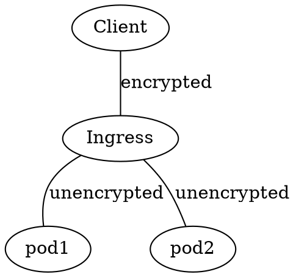

# ch5 Services Overview

- This chapter covers:
  - Creating Service resources to expose a group of pods at a single address
  - Discovering services in the cluster
  - Exposing Services to external clients
  - Conntecting to external services from inside the cluster
  - Controlling whether a pod is ready to be part of the service or not
  - Troubleshooting servics

- Services allow a group of pods to be accessible over a single IP address.

- You can't point to a single pod's IP because:
  - *Pods are ephemeral*
  - *Kubernetes assignes an IP address to a pod after the pod has been schdeuled to a node and before it's started* so client's can't know the pod's IP before it's started
  - *Horizontal scaling means multiple pods may provide the same service* Clients shouldn't have to load balance across the pods themselves.

## 5.1 Introducing Services

- A service's external IP address and port never change while the service exists.
- Services route incoming traffic to the various pods backing the service

#### Explaining Services with an Example

- A typical website has a front-end that connects to a back-end database. In this architecture, users connect to the front-end through a service, then the front-end connects to the database through a service.

### 5.1.1 Creating Services

- Services, like ReplicaSets use label-selectors to specify which pods they are backed by.
- We'll now re-create a test replication-controller from last chapter ([kubia-rc.yaml](../ch4_replication_controllers_etc/exercises/kubia-rc.yaml)), then we'll create a service for it.

```sh
$ kubectl create -f ../ch4_replication_controllers_etc/exercises/kubia-rc.yaml
replicationcontroller/kubia created

$ kubectl get rc
NAME    DESIRED   CURRENT   READY   AGE
kubia   3         3         3       12s
```

#### Creating a Service Through kubectl Expose

- The easiest way to create a service is using `kubectl expose kubia` which creates a service with the same pod selector as the replication controller.

#### Creating a Service Through a YAML Descriptor

- You can also use `kubectl create -f <file>` to create services. Here we will use [kubia-svc.yaml](./examples/kubia-svc.yaml) as our file.

- Syntax notes:
  - `port` is the external port.
  - `targetPort` is the port inside the container traffic is forwarded to.
  - `selector` is the container selector.

```sh
$ kubectl create -f ./examples/kubia-svc.yaml 
service/kubia created
```

#### Examining Your New Service

```sh
$ kubectl get svc
NAME         TYPE        CLUSTER-IP     EXTERNAL-IP   PORT(S)   AGE
kubernetes   ClusterIP   10.96.0.1      <none>        443/TCP   10m
kubia        ClusterIP   10.96.177.36   <none>        80/TCP    37s
```

- `kubia` is the service we just created
- The `CLUSTER-IP` is only accessible from other pods inside the cluster.
- When you expose the service, you will get an `EXTERNAL-IP`, but we'll do that later.

#### Testing Your Service from within the Cluster

- Ways to send requests to your service from within the cluster:
  - Create a pod to send requests to the service's cluster IP and log the response. Then look at the log to see what the service's response was.
  - SSH into one of the nodes and use the `curl` command
  - Use `curl` in a pod using `kubectl exec`

- In this example, we will use the 3rd option

#### Remotely Executing Commands in Running Containers

- Use `kubectl exec` to execute a command in a running container.

```sh
$ kubectl get pods
NAME          READY   STATUS    RESTARTS   AGE
kubia-66r8r   1/1     Running   0          2d15h
kubia-l24cd   1/1     Running   0          2d15h
kubia-rpbw7   1/1     Running   0          2d15h

$ kubectl exec kubia-66r8r -- curl -s http://10.96.177.36
You've hit kubia-rpbw7
```

- The double dash `--` tells `kubectl exec` that any arguments after it belong to the command argument so `kubectl exec` should ignore them and let `curl` (or whatever command your run) use them.

- When we executed the above command:
  1. kubernetes executed `curl -s http://10.96.177.36` inside the `kubia-66r8r` pod.
  2. Curl sent an HTTP request to the `kubia` service.
  3. `kubia` (randomly) forwarded the request to `kubia-rpbw7` that matched its label selector.
  4. `kubia-rpbw7`'s Node.js server responded to the request with its name.
  5. Curl printed the response to STDOUT which was intercepted and printed to its standard output on the local machine.

- `kubectl exec` is good for debugging because you can see what happened inside the container.

#### Configuring Session Affinity on the Service

- By default, services load balance across all pods. If you make multiple requests to a service your request will go to different pods.
- If you don't want traffic from a single IP to go to a single pod use `Service.spec.sessionAffinity: ClientIP` instead of `Service.spec.sessionAffinity: None` which is the default.
- `sessionAffinity: ClientIP` is important to specify if you're using cookies in your website.

```sh
apiVersion: v1
kind: Service
spec:
  sessionAffinity: ClientIP
...
```

#### Exposing Multiple Ports in the Same Service

- You can specify multiple port forwarding rules when creating a service.
- *When forwarding multiple ports, you have to specify a name for each port*.
- Note, services can only have one label selector. To forward ports to specific pods, you need to create multiple services.

- example of specifying multiple ports:

```sh
apiVersion: v1
kind: Service
metadata:
  name: kubia
spec:
  ports:
  - name: http
    port: 80
    targetPort: 8080
  - name: http-again
    port: 443
    targetPort: 8080
  selector:
    app: kubia
```

- Note, in the above example, we forwarded multiple ports to the same target port. This allowed us to not have to specify multiple ports in the pod description but in reality each rule would probably have different target ports.

- Let's edit our service description and try it.

```sh
$ kubectl edit -f ./examples/kubia-svc.yaml 
service/kubia edited
$ kubectl exec kubia-66r8r -- curl -s http://10.96.177.36:443
You've hit kubia-l24cd
```

#### Using Named Ports

- You can use the pod's port name as the service target port instead of its port number.
- As an example, [named-port-service.yaml](./examples/named-port-service.yaml)'s target port is specified using [named-port-rc.yaml](./examples/named-port-rc.yaml)'s port names

```sh
$ kubectl create -f ./examples/named-port-rc.yaml 
replicationcontroller/kubia created

$ kubectl get po
NAME          READY   STATUS    RESTARTS   AGE
kubia-mp4sr   1/1     Running   0          19m
kubia-nbzps   1/1     Running   0          19m
kubia-wfdpr   1/1     Running   0          19m

$ kubectl exec kubia-mp4sr -- curl -s kubia
You've hit kubia-wfdpr
```

- Beware, pods can't curl themselves through a service in minikube [see here for related stack overflow question](https://stackoverflow.com/questions/60043236/why-cant-my-service-pass-traffic-to-a-pod-with-a-named-port-on-minikube)
- Naming ports is good because it means you can change the `containerPort` without changing the `targetPort` the service maps to

### 5.1.2 Discovering Services

- Kubernetes provides ways for pods to discover their service's IP

#### Discovering Services Through Environment Variables

- Pods are initialized with environment variables including variables relating to the services that exist when they're created including variables for the pod's IP and port.

```sh
$ kubectl exec kubia-mp4sr env
...
KUBERNETES_PORT_443_TCP_PORT=443
KUBERNETES_PORT_443_TCP_ADDR=10.96.0.1
KUBIA_SERVICE_PORT=80
KUBIA_PORT=tcp://10.96.129.124:80
KUBIA_PORT_80_TCP=tcp://10.96.129.124:80
KUBERNETES_PORT_443_TCP_PROTO=tcp
KUBIA_SERVICE_HOST=10.96.129.124
KUBERNETES_SERVICE_HOST=10.96.0.1
KUBERNETES_SERVICE_PORT=443
KUBERNETES_PORT=tcp://10.96.0.1:443
KUBIA_PORT_80_TCP_PROTO=tcp
KUBIA_PORT_80_TCP_PORT=80
KUBERNETES_SERVICE_PORT_HTTPS=443
KUBERNETES_PORT_443_TCP=tcp://10.96.0.1:443
KUBIA_PORT_80_TCP_ADDR=10.96.129.124
...
```

- Note, dashes in the service name are converted to underscores and all letters ar uppercased when the service name is used as the prefix in the environment variable's name.
- Environment variables can be convenient way to get this information in your code.

#### Discovering Services Through DNS

- Kubernetes comes with its own DNS service for resolving running service names using their fully qualified domain name (FQDN):

```sh
$ kubectl get svc --namespace kube-system
NAME       TYPE        CLUSTER-IP   EXTERNAL-IP   PORT(S)                  AGE
kube-dns   ClusterIP   10.96.0.10   <none>        53/UDP,53/TCP,9153/TCP   6d2h
```

- When kubernetes creates a pod, it adds the  kube-dns server to each container's `/etc/resolv.conf` file.
  - Note: How this file is treated can be configured with the `Pod.spec.dnsPolicy` setting
  - Run `$ man resolv.conf` for more information on this file.

#### Conecting to the Service Through its FQDN

- The FDQN of a pod is in the form `pod-name.<namespace>.<cluster-domain-suffix>`. 


- Our pod's namespace is `default` and its custer domain suffix is `svc.cluster.local` as you can see in its /etc/resolv.conf:

```sh
$ kubectl exec kubia-mp4sr -- cat /etc/resolv.conf
nameserver 10.96.0.10
search default.svc.cluster.local svc.cluster.local cluster.local us-reston-iss.leidos.com
options ndots:5
```

- You can use the FDQN to connect to pods backing a service:

```sh
$ kubectl exec kubia-mp4sr -- curl -s kubia.default.svc.cluster.local
You've hit kubia-nbzps
```

- But the search values in /etc/resolv.conf tell your pod what domains to search for hostnames. Meaning you don't have to specify the FDQN everytime you make a request if the service's pods' `<namespace>.<cluster-domain-suffix>` is in the search list.

```sh
$ kubectl exec kubia-mp4sr -- curl -s kubia
You've hit kubia-wfdpr
```

- You shouldn't change your pod's /etc/resolv.conf, but if you have to:
  - set `Pod.spec.dnsPolicy: None`
  - add your custom setting in the `Pod.spec.dnsConfig` section

- Note, DNS will only look-up the IP address not the port. You will still have to specify the port you want to connect to the service's pods on.

#### Running a Shell in a Pod's Container

- To run a shell in a Pod's container:

```sh
$ kubectl exec <pod-name> -it -- bash
```

- Don't forget the `-it`

#### understanding Why You Can't Ping a Service IP

- You can't ping services because service's IPs are virtual IPs. They have no meaning without also specifying a port.
- More on this in CH 11

## 5.2 Connecting to Services Living outside the Cluster

- So far our service has load balanced across pods inside the cluster.
- It can also load balance across nodes outside the cluster.
- This further abstracts load balancing and discovery away from pods and onto services.

### 5.2.1 introducing Service Endpoints

- Services store the IPs and ports they load balance across in `endpoints` resources.

```sh
$ kubectl get endpoints
NAME         ENDPOINTS                                            AGE
kubernetes   10.58.246.209:8443                                   3h30m
kubia        172.17.0.10:8080,172.17.0.11:8080,172.17.0.12:8080   142m
```

- `endpoints` resources are built using a service's label selectors. Services don't directly use label selectors to route traffic.

### 5.2.2 Manually Configuring Service Endpoints

- Service's endpoints resource are generally created automatically from the label selector, but you can create them manually too. If you wanted, you could even route a service's traffic by linking it to an end point without specifying a label selector for the service.

#### Creating a Service without a Selector

- First, create a service without the `Service.spec.selector` field as in [external-service.yaml](./examples/external-service.yaml)

```sh
$ kubectl create -f ./examples/external-service.yaml 
service/external-service created
```

- The name of the service *must* match the name of the endpoints object.

#### Creating an Endpoints Resource for a Service without a Selector

- Because we didn't specify a selector, our service hasn't yet created an endpoints object. So we must create one.
- Use [external-service-endpoints.yaml](./examples/external-service-endpoints.yaml) to create the `external-service` endpoint for the service. Note its name is the same as the service's.

```sh
$ kubectl create -f ./examples/external-service-endpoints.yaml 
endpoints/external-service created

$ kubectl get services external-service -o wide
NAME               TYPE        CLUSTER-IP      EXTERNAL-IP   PORT(S)   AGE   SELECTOR
external-service   ClusterIP   10.96.225.204   <none>        80/TCP    13m   <none>

$ kubectl get endpoints external-service
NAME               ENDPOINTS                       AGE
external-service   11.11.11.11:80,22.22.22.22:80   7m11s
```

- Now if a pod makes a request to the service `external-service`, it gets sent to 11.11.11.11 or 22.22.22.22 on port 80. We could send this anywhere (google.com for example).
- If you add a label selector to the service `external-service`, kubernetes will manage the endpoints automatically. If you remove the label-selector, kubernetes will stop managing its endpoints and you can edit them. This means the services external IP can remain constant while you edit where it points.

### 5.2.3 Creating an Alias for an External Service

- You can point a service at an external domain by:
  - Setting `Service.spec.type: ExternalName`
  - Setting `Service.spec.externalName: <the-domain>`

- Pointing a service to an external domain makes it easier to change in the future.
- Here we'll set up [external-service-api.yaml](./examples/external-service-api.yaml) to point to the what's open API.

```sh
$ kubectl create -f ./examples/external-service-api.yaml 
service/external-service-api created

$ kubectl get service external-service-api 
NAME                   TYPE           CLUSTER-IP   EXTERNAL-IP        PORT(S)   AGE
external-service-api   ExternalName   <none>       api.srct.gmu.edu   80/TCP    92s

$ kubectl exec kubia-mp4sr -- curl external-service-api
  % Total    % Received % Xferd  Average Speed   Time    Time     Time  Current
                                 Dload  Upload   Total   Spent    Left  Speed
100    12  100    12    0     0     67      0 --:--:-- --:--:-- --:--:--    67
Hello world
```

- `ExternalName` services are implemented at the DNS level. A simple CNAME DNS record is created for the service. Therefore clients connecting to the service will connect to the external service directly, bypassing the service proxy completely. For this reason, the service has no CLUSTER-IP.
  - Note, a CNAME points to a FDQN, not an IP address.

## 5.3 Exposing Services to External Clients

- To expose your services to clients outside the cluster either:
  - *Set the service type to `NodePort`* - For a `NodePort` service, each cluster node opens a port on the node itself (hence the name) and redirects traffic received on that port to the underlying service. The service isn't accessible only at the internal cluster IP and port, but also through a dedicated port on __all__ nodes.
  - *Setting the service type to `LoadBalancer`, an extension of the `NodePort` type* - This makes the service accessible through a dedicated load balancer, provisioned from the cloud infrastructure Kubernetes is running on. The load balancer redirects traffic to the node port across all the nodes. Clients connect to the service through the load balancer's IP.
  - *Creating an `Ingress` resource, a radically different mechanism for exposing multiple services through a single IP address* - It operates at the HTP level (network layer 7) and can thus offer more features than layer 4 services can. (see 5.4)

### 5.3.1 Using a NodePort Service

- If you create a node-port service, requests to the reserved port on *any* of the nodes in the network (or the cluster-ip) get handled by the service.

#### Creating a NodePort Service

- Here we'll use [kubia-svc-nodeport.yaml](./examples/kubia-svc-nodeport.yaml) to create a node-port service.

- Syntax notes:
  - `Service.spec.type: NodePort` must be set.
  - `Service.spec.ports.port` is the port the service can be reached at on the Cluster IP
  - `Service.spec.ports.targetPort` is the port the service can be reached at in the pods
  - `Service.spec.ports.nodePort` is the port the service can be reached at on all the nodes.

- In GKE, you will get a warning about configuring firewalls. We'll see that soon.

#### Examining Your NodePort Service

```sh
$ kubectl get svc kubia-nodeport 
NAME             TYPE       CLUSTER-IP      EXTERNAL-IP   PORT(S)        AGE
kubia-nodeport   NodePort   10.96.184.196   <none>        80:30123/TCP   5m59s

$ kubectl get ep kubia-nodeport 
NAME             ENDPOINTS                                         AGE
kubia-nodeport   172.17.0.7:8080,172.17.0.8:8080,172.17.0.9:8080   104m
```

- The service is now available at:
  - Port 30123 on all nodes
    - `localhost:30123` because localhost is a node in the network
    - Note, if you connect to one of these NodePorts, you will be redirected by the service to a pod that may not be on the node you origionally connected to.
  - Port 80 on the cluster IP
    - `10.96.184.196:80`
  - Port 8080 in the pods
    - `172.17.0.8:8080`

#### Changing Firewall Rules to Let External Clients Access Our NodePort Service

- GCP requires you to set firewall rules with:

```sh
$ gcloud compute firewall-rules create kubia-svc-rule -- allow=tcp:30123
```

- Getting a node's IPs:

```sh
$ kubectl get nodes -o jsonpath='{.items[*].status.addresses[?(@.type=="ExternalIP")].address}'
```

- The above command uses [JSONPath](https://kubernetes.io/docs/reference/kubectl/jsonpath/). This is similar to XPath for XML.
- My minikube isntance doesn't have any external IP addresses but you can see my node's internal IPs with:

```sh
$ kubectl get nodes -o jsonpath='{.items[*].status.addresses}'
[map[address:10.58.246.209 type:InternalIP] map[address:minikube type:Hostname]]
```

- In minikube, you can hit a service using `minikube service<service-name>`:

```sh
$ minikube service kubia-nodeport
```

- NodePort services are bad because if a node goes down references to your service will break.

### 5.3.2 Exposing a Service Through an External Load Balancer

- The LoadBalancer service type is an extension of the NodePort service type that provides an infrastructure-provided external IP to the service's cluster IP. It still maps a port on the nodes the same way NodePort services do.
- Minikube doesn't support LoadBalancer services.
- Cloud providers (GKE) usually support automatic provisioning of load balancers from the cloud infrastructure. Simply by creating a LoadBalancer service instead of NodePort, you get a public IP.

#### Creating a LoadBalancer Service

- Use [kubia-svc-loadbalancer.yaml](./examples/kubia-svc-loadbalancer.yaml) to create the LoadBalancer service

#### Connecting to the Service Through the LoadBalancer

- The LoadBalancer will take a while to start because the host has to assign an IP to it.
- I did this on a locally hosted kubernetes instance, so I didn't get an external IP:

```sh
$ kubectl get svc kubia-loadbalancer
NAME                 TYPE           CLUSTER-IP      EXTERNAL-IP   PORT(S)        AGE
kubia-loadbalancer   LoadBalancer   10.98.156.222   <pending>     80:30661/TCP   9m36s

$ kubectl describe svc kubia-loadbalancer
Name:                     kubia-loadbalancer
Namespace:                default
Labels:                   <none>
Annotations:              <none>
Selector:                 app=kubia
Type:                     LoadBalancer
IP:                       10.98.156.222
Port:                     <unset>  80/TCP
TargetPort:               8080/TCP
NodePort:                 <unset>  30661/TCP
Endpoints:                10.10.0.224:8080
Session Affinity:         None
External Traffic Policy:  Cluster
Events:                   <none>

$ curl 10.98.156.222
You've hit kubia
```

##### Session affinity and web browsers

- Browsers use keep-alive connections and send all requests through a single connection. This means you will stay connected to a single pod even though you didn't specify session affinity for the service.

### 5.3.3 Understanding the Peculiarities of External Connections

- External connections to services have some challenges

#### Understanding and Preventing Unnecessary Network Hops

- In kubernetes, the kube-proxy (running on nodes) forwards all traffic based on network rules. Setting `Service.spec.externalTrafficPolicy: Local` tells the kube-proxy to not forward requests to external nodes.

- Adding `Service.spec.externalTrafficPolicy: Local` means traffic won't take multiple hops to get to a pod, but:
  - LoadBalancers only have iptable rules for nodes, not pods. Therefore LoadBalancers balance traffic across nodes no matter how many replicas of your app each node is running resulting in un-even distribution of work across pods (see 5.5).
  - If one of your nodes/pods is unhealthy or the node doesn't have the corresponding pod running, it has no way to redirect traffic elsewhere. This makes it important to ensure the load balancer forwards connections only to pods that have at least one such pod healthy running.

- Note:
  - The [loadbalancer depends on provider](https://stackoverflow.com/questions/55435926/how-does-loadbalancer-forward-traffic-to-the-target-service)
  - How kubernetes [handles forwarding](https://stackoverflow.com/questions/60067188/how-do-kubernetes-nodeport-services-with-service-spec-externaltrafficpolicy-loca/60067630#60067630) is complex.
    - More on kubernetes' [iptables](https://stackoverflow.com/questions/54865746/how-does-k8s-service-route-the-traffic-to-mulitiple-endpoints) in depth
    - More on this in ch 11.1.8

#### Being Aware of the Non-Preservation of the Client's IP

- When a client connects to a NodePort, the kube-proxy forwards the client's traffic to a pod using Source Network Address Translation (SNAT). SNAT changes the sender address from client's IP address to the current node's IP address so traffic can be sent back to the current node after it gets forwarded to another node.
- As a result of SNAT, you generally can't see a client's IP address.
- Setting `Service.spec.externalTrafficPolicy: Local` preserves the packet's source IP by not performing Source Network Address Translation (SNAT).

## 5.4 Exposing Services Externally Through an Ingress Resource

- Ingress resources are a third way of exposing a service to external clients.

#### Understanding Why Ingresses are Needed

- LoadBalancers are a single service that uses an entire external IP to route to pods of a single label selector type.
- Ingress resources can route to different services (and therefore sets of pods) based on the URL host and path used to connect to them.
- Ingresses operate at the application layer of the network stack (HTTP) and can provide features such as cookie-based session affinity and the like, which services can't.

#### Understanding That an Ingress Controller is Requires

- On minikube, you have to enable the ingress plugin:

```sh
$ minikube addons enable ingress
✅  ingress was successfully enabled

$ minikube addons list
...
```

- GKE uses GCP's HTTP load-balancing to provide the ingress functionality.
- Some kubernetes implementations don't provide ingress.
- To handle ingress, kubernetes runs an ingress controller, much like the kube-proxy. It's usually in the `kube-system` namespace, but not always.

```sh
$ kubectl get po --namespace kube-system 
NAME                                        READY   STATUS        RESTARTS   AGE
coredns-6955765f44-l4jvr                    1/1     Running       1          8d
coredns-6955765f44-ntsfm                    1/1     Running       1          8d
etcd-minikube                               1/1     Running       1          8d
kube-addon-manager-minikube                 1/1     Running       1          8d
kube-apiserver-minikube                     1/1     Running       1          8d
kube-controller-manager-minikube            1/1     Running       1          8d
kube-ingress-dns-minikube                   1/1     Running       0          9m13s
kube-proxy-825q8                            1/1     Running       1          8d
kube-scheduler-minikube                     1/1     Running       1          8d
nginx-ingress-controller-6fc5bcc8c9-8jzbx   1/1     Running       0          9m32s
nvidia-driver-installer-zvms4               0/1     Terminating   0          10m
nvidia-gpu-device-plugin-cvqbh              1/1     Running       0          8m58s
storage-provisioner                         1/1     Running       2          8d
```

### 5.4.1 Creating an Ingress Resource

- Create an ingress resource with [kubia-ingress.yaml](./examples/kubia-ingress.yaml)

- Syntax notes:
  - `apiVersion: extensions/v1`
  - `Ingress.spec.rules` is a set of ingress rules.
      - `Ingress.spec.rules.host` says this rule applies to traffic to `kubia.example.com`
      - `Ingress.spec.rules.http.paths.path: /` says this rule applies to traffic to `host/`. You could make this a longer path for more detailed traffic control.
      - `Ingress.spec.rules.http.paths.backend` tells where to map traffic to
          - `Ingress.spec.rules.http.paths.serviceName: kubia-nodeport` maps traffic to the Kubia-nodeport service
          - `Ingress.spec.rules.http.paths.servicePort: 80` maps the traffic to port 80 of the service.

- Note, ingress controllers on cloud providers (like GKE) require the Ingress to point to a NodePort service. But that's not a requirement of Kubernetes.

```sh
$ kubectl create -f ./examples/kubia-ingress.yaml 
ingress.extensions/kubia created
```

### 5.4.2 Accessing the Service Through the Ingress

- To access your service through http://kubia.example.com, you'll need to make sure the domain name resolves to the IP of the Ingress controller.

#### kubecing the IP Address of the Ingress

- Ingresses take a while to start in cloud providers, because the Ingress controller provisions a load balancer behind the scenes.

- Usually you can find your ingress'es IP with:

```sh
$ kubectl get ingress
NAME    HOSTS               ADDRESS   PORTS   AGE
kubia   kubia.example.com   a.a.a.a   80      6s
```

- But on minikube, use `minikube ip` to get the IP address

#### Ensuring the Host Configured in the Ingress Points to the Ingress's IP Address

- Add a line in `/etc/hosts` (or `C:\windows\system32\drivers\etc\hosts`) that points `kubia.example.com` to your IP.

```sh
10.58.246.209   kubia.example.com
```

- This allows you to send traffic to that IP without publically listing it as a domain name.

#### Accessing Pods Through the Ingress

- Now you can hit it:

```sh
$ curl kubia.example.com
You've hit kubia-nnkc4
```

#### Understanding How Ingresses Work

- Ingress controllers get the *host* and *path* from the HTTP GET headers.
- Once ingress controllers get this information, they ask the related service (defined in their rules) where to forward requests to.
- Then the ingress sends traffic *directly* to the service's pods.

### 5.4.3 Exposing Multiple Services Through the Same Ingress

- Ingress's ``Ingress.spec.rules` and `Ingress.spec.rules.http.paths` attributes are both arrays. Exposing multiple hosts and/or paths is as simple as adding more elements to these arrays.

#### Mapping Different Services to Different Paths of the Same Host

- Adding another element to `Ingress.spec.rules.http.paths` routes requests to different paths on a single IP to different services.

#### Mapping Different Services to Different Hosts

- Adding another element to `Ingress.spec.rules` allows you to route multiple website domains (and sub-domains) to different services.### 

### 5.4.4 Configuring Ingress to Handle TLS Traffic

- This section will cover manually configuring TLS certificates. This is covered more in chapter 7. Automatic management of certificates with tools like [ambassador](https://auth0.com/blog/kubernetes-tutorial-managing-tls-certificates-with-ambassador/) is ideal.

#### Creating a TLS Certificate for the Ingress

- Ingress controllers terminate the TLS tunnel before they forward traffic to the service's pods.



- This means:
  - pods don't have to configure https.
  - TLS certs and private keys are configured at the Ingress Controller level using kubernetes Secrets (see ch 7 for secrets).

##### Example TLS over Ingress

- First, create the private key and cert:

```sh
$ openssl genrsa -out tls.key 2048Generating RSA private key, 2048 bit long modulus (2 primes)
................................................................................................................................................................................+++++
........................................................................+++++
e is 65537 (0x010001)

$ touch ~/.rnd # note, this may not be necessary if it already exists.

$ sudo openssl req -new -x509 -key tls.key -out tls.cert -days 360 -subj /CN=kubia.example.com
```

- Then, create a Secret called `tls-secret` to store the key and certs like this:

```sh
$ kubectl create secret tls tls-secret --cert=tls.cert --key=tls.key
secret/tls-secret created
```

- Instead of manually signing keys, you can generate a `CertificateSigningRequest` (CSR) resource from a regular certificate request. Later, the request is approved by a signer *within the cluster* with `$ kubectl certificate approve <name of the CSR>`. The certificate can then be retrieved from the CSR's `status.certificate` field.
- Now we can replace our ingress controller with [kubia-ingress-tls.yaml](./examples/kubia-ingress-tls.yaml)

- Notes on syntax for kubia-ingress-tls.yaml:
  - The `Ingress.spec.tls` links the secret to the ingress controller
  - `Ingress.spec.tls.hosts.secretName` Is where the secret is listed
  - Pretty much everything else is the same.

- Note, you can use `kubectl apply` instead of `kubectl delete` then `kubectl create` to overwrite the running ingress controller. I didn't

```sh
$ kubectl delete ingresses kubia 
ingress.extensions "kubia" deleted

$ kubectl create -f kubia-ingress-tls.yaml 
ingress.extensions/kubia created

$ kubectl get ingress
NAME    HOSTS               ADDRESS   PORTS     AGE
kubia   kubia.example.com             80, 443   11s

$ curl --insecure https://kubia.example.com
You've hit kubia-nnkc4
```

- Note, you have to add the `--insecure` flag to curl so it accepts self-signed certificates. You can also add the `-v` flag to make it verbose if you want to see debugging information about the cert.
- Ingress' features vary between implementations, so check the implementation's docs to see what's supported.

## 5.5 Signaling When a Pod is Ready to Accept Connections

- Services and ingresses shouldn't send request to Pods that can't handle them.
  - For example, pods that haven't finished booting yet.

### 5.5.1 Introducing Readiness Probes

- Readiness probes are similar to liveness probes from ch 4, but work by not sending traffic to pods that aren't ready to receive it instead of deleting unhealthy pods.

#### Types of Readiness Probes

- 3 types of readiness probes exist:
  1. An *Exec* probe, where a process is executed. The container's status is determined by the process' exit status code.
  2. An *HTTP GET* probe, which sends an HTTP `GET` request to the container and the HTTP status code of the response dtermines whether the container is ready or not.
  3. A *TCP Socket* probe, which opens a TCP connection to a specified port of the container. If the connection is established, the container is considered ready.

#### Understanding the Operation of Readiness Probes

- Readiness probes remove pods from a service if they're not ready. 
- If the pod becomes ready later, the pod is added back into the service.
- In contrast to liveness probes which delete pods that aren't working.
- Readiness probes wait a configurable amount of time to start probing, then probe at a configurable interval.

#### Understanding Why Readiness Probes are Important

- Readiness probes ensure pod downtime doesn't affect clients.

### 5.5.2 Adding a Readiness Probe to a Pod

- You add readiness probes to your pods by modifying the Replication Controller's pod template.

#### Adding a Readiness probe to the Pod Template

- We will now start a replication controller with a readiness probe using [kubia-rc-readinessprobe.yaml](./examples/kubia-rc-readinessprobe.yaml)
- We added the following `ReplicationController.spec.template.spec.containers.readinessProbe` section:

```sh
readinessProbe:
    exec:
    command:
    - ls
    - /var/ready
```

- This section adds an exec readiness probe that runs the command `ls /var/ready` in the container. `ls` returns 0 (success) if the file exists, else non-zero.

- Now we will use the readiness controller. Be aware:
  - This file isn't created by default in the kubia image so our pods will not be ready by default.
  - Altering a replication controller's template has no affect on existing pods, so we have to delete the old pods before our changes take effect.

```sh
$ kubectl delete rc kubia
replicationcontroller "kubia" deleted

$ kubectl get po
NAME          READY   STATUS        RESTARTS   AGE
kubia-fb7h8   1/1     Terminating   0          2d16h
kubia-nnkc4   1/1     Terminating   0          2d16h
kubia-s88mt   1/1     Terminating   0          2d16h

$ kubectl get po
No resources found in default namespace.

$ kubectl create -f kubia-rc-readinessprobe.yaml 
replicationcontroller/kubia created
```

#### Observing and Modifying the Pods' Readiness Status

```sh
$ kubectl get po
NAME          READY   STATUS    RESTARTS   AGE
kubia-4vhwc   0/1     Running   0          11m
kubia-7lg9j   0/1     Running   0          11m
kubia-nvqzp   0/1     Running   0          11m
```

- The `READY` column shows none of the pods are ready because they don't have the `/var/ready` file.
- Now we make the pod ready by creating the file:

```sh
$ kubectl exec kubia-4vhwc -- touch /var/ready

$ kubectl get po
NAME          READY   STATUS    RESTARTS   AGE
kubia-4vhwc   1/1     Running   0          14m
kubia-7lg9j   0/1     Running   0          14m
kubia-nvqzp   0/1     Running   0          14m
```

- Note, readiness check aren't immediate. You can see how often they happen with `kubectl describe pod <pod-name>`. The description will include a line like `Readiness:      exec [ls /var/ready] delay=0s timeout=1s period=10s #success=1 #failure=3` which says to run the readiness probe every 10 seconds.
- We can further see that our pod is ready with:

```sh
$ kubectl get ep
NAME             ENDPOINTS            AGE
kubernetes       10.58.246.209:8443   2d16h
kubia-nodeport   172.17.0.8:8080      47h
```

#### Hitting the Service with the Single Ready Pod

- Services only send traffic to ready pods. In our case, we only have 1 ready pod:

```sh
$ kubectl get svc kubia-nodeport 
NAME             TYPE       CLUSTER-IP     EXTERNAL-IP   PORT(S)        AGE
kubia-nodeport   NodePort   10.96.191.43   <none>        80:30123/TCP   47h

$ for i in {1..5}; do curl 10.96.191.43; done
You've hit kubia-4vhwc
You've hit kubia-4vhwc
You've hit kubia-4vhwc
You've hit kubia-4vhwc
You've hit kubia-4vhwc
```

### 5.5.3 Understanding What Real-world Readiness Probes Should Do

- A real readiness probe should test if the application is ready to receive traffic (`ls` doesn't do that).

- In the real world manually removing pods from services should be done by deleting the pod or changing the pod's labels:

```sh
$ kubectl label po kubia-7lg9j --overwrite app=NotReady
pod/kubia-7lg9j labeled

$ kubectl get po --show-labels 
NAME          READY   STATUS    RESTARTS   AGE    LABELS
kubia-4vhwc   1/1     Running   0          53m    app=kubia
kubia-7lg9j   0/1     Running   0          53m    app=NotReady
kubia-nvqzp   0/1     Running   0          53m    app=kubia
kubia-wsx9g   0/1     Running   0          4m8s   app=kubia
```

#### Always Define a Readiness Probe

- Adding readiness probes to your pods is very important. If you don't add them, they'll become endpoints almost immediately and will drop client connections.
- Readiness probes can start as simply as sending an HTTP request to the base URL

#### Don't Include Pod Shutdown Logic in Your Readiness Probes

- Kubernetes marks pods as not ready when you delete them.
- You don't need to handle deletion events yourself with readiness probes.

## 5.6 Using a Headless Service for Discovering Individual Pods

- Services balance across their backing pods.
- Headless services allow clients to connect to the pods individually by setting `Service.spec.clusterIP` to `None`. This adds DNS records for all the pods instead of just the cluster IP.

### 5.6.1 Creating a Headless Service

- First, delete the replication controller with the readiness probe and create one without a readiness probe so we have more than 1 pod.

```sh
$ kubectl delete rc kubia 
replicationcontroller "kubia" deleted
$ kubectl create -f ./named-port-rc.yaml 
replicationcontroller/kubia created
```

- Use [kubia-svc-headless.yaml](./examples/kubia-svc-headless.yaml) to create a headless service.

```sh
$ kubectl create -f kubia-svc-headless.yaml 
service/kubia-headless created
```

### 5.6.2 Discovering Pods Through DNS

- Kubia doesn't include nslookup, so we'll create a new pod that does

#### Running a Pod without Writing a YAML Manifest

- You can create a pod directly from an image like this:

```sh
$ kubectl run distutils --image=tutum/dnsutils --generator=run-pod/v1 --command -- sleep infinity
pod/distutils created
```

- `--generator=run-pod/v1` tells `kubectl` to create the pod directly, without any controller behind it.

#### Understanding DNS A records Returned for a Headless Service

- We can now see that we have multiple records for the kubia-headless service because we don't have a cluster IP.

```sh
$ kubectl exec distutils -- nslookup kubia-headless
Server:         10.96.0.10
Address:        10.96.0.10#53

Name:   kubia-headless.default.svc.cluster.local
Address: 172.17.0.15
Name:   kubia-headless.default.svc.cluster.local
Address: 172.17.0.13
Name:   kubia-headless.default.svc.cluster.local
Address: 172.17.0.14
```

- Normally, we would only hav a single cluster IP:

```sh
$ kubectl exec distutils -- nslookup kubernetes
Server:         10.96.0.10
Address:        10.96.0.10#53

Name:   kubernetes.default.svc.cluster.local
Address: 10.96.0.1
```

- Note, headless services provide loadbalancing across pods trhough DNS's round-robin instead of through the service proxy.

### 5.6.3 Discovering All Pods-Even those that aren't Ready

- To tell a headless service to add pods that aren't ready to a service add this annotation:

```sh
service.alpha.kubernetes.io/tolerate-unready-endpoints: "true"
```

- This is in alpha, so it may be removed. It is dangerous. It also is similar to `Service.spec.publishNotReadyAddresses` which is supposed to replace it.

## 5.7 Troubleshooting Services

- Common problems when trying to connect to a service:
  - Make sure you're connecting to the service's cluster IP from within the cluster, not from the outside.
  - services don't respond to pings (they're virtual IPs)
  - Make sure your readiness probes are working
  - check endpoints
  - If your FQDN doesn't work try using the actual IP address
  - Check that you're connecting to the right port.
  - Check that the pod is working from inside the cluster over its IP as a simple test
  - If you can't even access your app through the pod's IP, make sure you app isn't only binding to localhost.

- More on services in ch 11

## 5.8 Summary

- Services enable exposing multiple pods over a single IP.

- We learned:
  - exposing pods that match a certain label selector under a single, stable IP address and port
  - Using NodePort and LoadBalancer to make services accessible externally
  - Pods discover services together with their IP addresses and ports by looking up environment variables
  - Services enable clients outside the cluster to talk to pods
  - How to provide a DNS CNAME alias for external services with the ExternalName service type
  - Exposing multipl HTTP services through a single Ingress (consuming a single IP)
  - Using a pod's container's readiness probe to determine whether a pod should or shouldn't be included as a service endpoint
  - Enabling discovery of pod IPs through DNS when you create a headless service

- along with getting a better understanding of how tp"
  - Troubleshoot them
  - Modify firewall rules in Google Kubernetes/Compute Engine
  - Execute commands in pod containers through kubectl exec
  - Run a bash shell in an existing pod's cnotaienr
  - Modify Kubernetes resources through the kubectl apply command
  - Run an unmanaged ad hoc pod with kubectl run --generator=run-pod/v1

