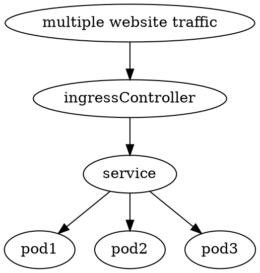

# hi

```graphviz
digraph g{
    rankdir=TB;

    traffic [label="multiple website traffic"];
    ingressController;
    service;
    pod1;
    pod2;
    pod3;

    traffic -> ingressController;

    ingressController -> service;

    service -> pod1;

    service -> pod2;

    service -> pod3;

}
```